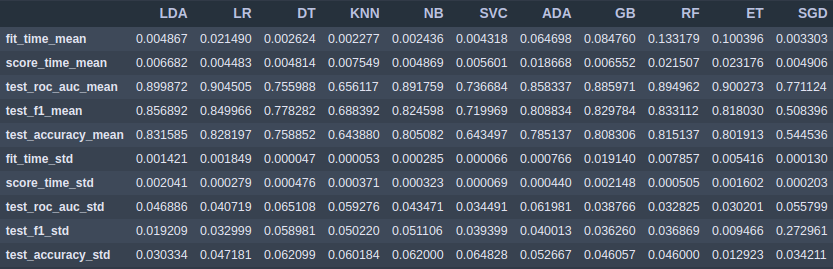
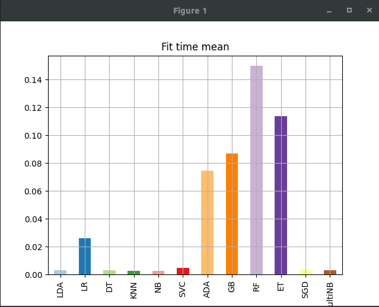
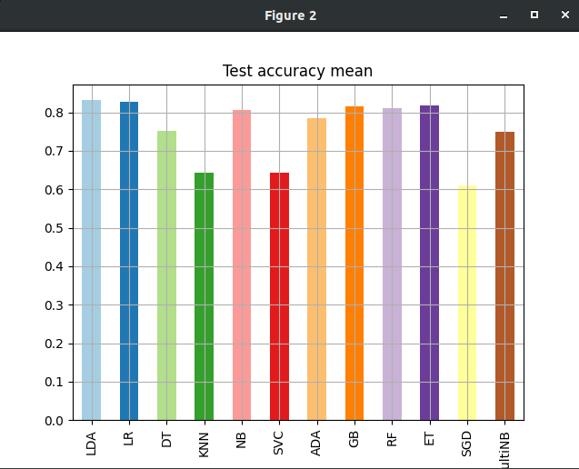

# Evaluate-ML-Algorithms
Simple python project that evaluates multiple ML algorithms in order to get know which algorithm performs the best

- This simple project, takes the data and fits iteratively multiple machine learning algorithms using sklearn *cross_validate* function.

**Usage**
python3 evaluate_multiple_algorithms.py  -d <*dataset_path*> -p <*classification or regression*> -t <*target column name*>

After fitting, the program reports the results. 

First it shows the results dataframe:

And then, it builds two plot:
**Bar plot with the fit times**

**Bar plot with the mean of a certain metric (for example accuracy)**

